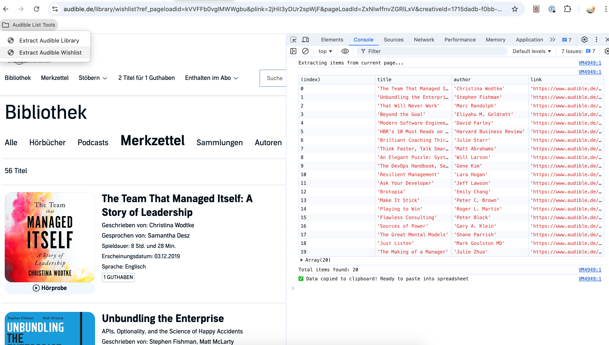
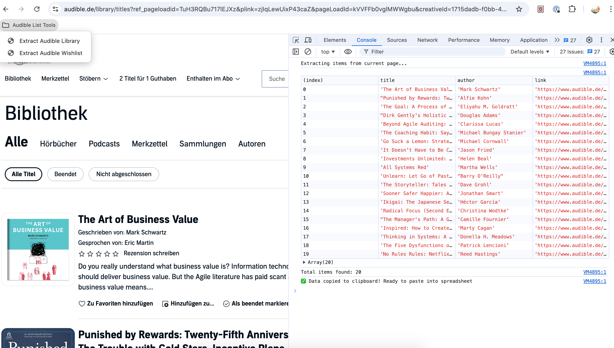

# Audible List Extractor Bookmarklets

Extracts titles, authors, and links from your Audible library and wishlist pages and formats them for spreadsheet import.

## Setup
Download the bookmark file and add them to your browser bookmarks via the browser's bookmark manager import.

## Usage
1. Navigate to your Audible library or wishlist page
2. Click the corresponding bookmarklet
3. Data is automatically copied to clipboard
4. Paste into your spreadsheet (Google Sheets/Excel)

## Features
- Extracts: Title, Author, Link
- Auto-copies to clipboard in TSV format
- Shows results in browser console
- Works on current page only (run again for each page) 

## Screenshots

